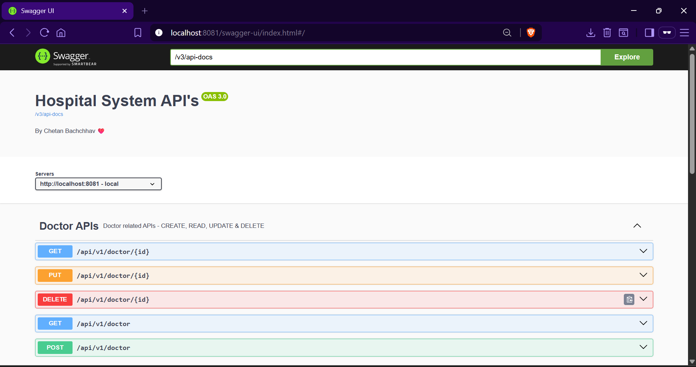

## API Endpoint's 

1. **Patient** 

    | Method | Endpoint                  | Description                                      |
    |--------|---------------------------|--------------------------------------------------|
    | GET    | /api/v1/patient           | Get list of all patients                         |
    | GET    | /api/v1/patient/:id       | Get patient details by ID                        |
    | POST   | /api/v1/patient           | Add a new patient                                |
    | PUT    | /api/v1/patient/:id       | Update patient details by ID                     |
    | DELETE | /api/v1/patient/:id       | Delete patient details by ID                     |

2. **Doctor**

    | Method | Endpoint                  | Description                                      |
    |--------|---------------------------|--------------------------------------------------|
    | GET    | /api/v1/doctor            | Get list of all doctors                          |
    | GET    | /api/v1/doctor/:id        | Get doctor details by ID                         |
    | POST   | /api/v1/doctor            | Add a new doctor                                 |
    | PUT    | /api/v1/doctor/:id        | Update doctor details by ID                      |
    | DELETE | /api/v1/doctor/:id        | Delete doctor details by ID                      |

3. **Bill**

    | Method | Endpoint                  | Description                                      |
    |--------|---------------------------|--------------------------------------------------|
    | GET    | /api/v1/bill              | Get list of all bills                            |
    | GET    | /api/v1/bill/:id          | Get bill details by ID                           |
    | POST   | /api/v1/bill              | Add a new bill                                   |
    | PUT    | /api/v1/bill/:id          | Update bill details by ID                        |
    | DELETE | /api/v1/bill/:id          | Delete bill details by ID                        |

4. **Appointments**

    | Method | Endpoint                  | Description                                      |
    |--------|---------------------------|--------------------------------------------------|
    | GET    | /api/v1/bill              | To get record/list of all Appointment            |
    | GET    | /api/v1/bill/:id          | To get record of Appointment with ID             |
    | POST   | /api/v1/bill              | To add Appointment details in application        |
    | PUT    | /api/v1/bill/:id          | To update details of Appointment with ID         |
    | DELETE | /api/v1/bill/:id          | To delete details of Appointment with ID         |


## Swagger API - 

- Swagger API is api documentation tool which is used in spring boot.
- It uses `Springdoc OpenAPI` it is designed to generate API documentation from spring boot application.
- `springdoc-openapi-ui` starter to use Swagger UI.
- Swagger uses `/v3/api-docs` endpoint, That provides the **JSON** representation of API documentation.
- default path - `localhost:8080/swagger-ui/index.html`, we can change it application.properties file.

**Springdoc OpenAPI Dependency**
```xml
<depedency>
    <groupId>org.springdoc</groupId>
    <artifactId>springdoc-openapi-ui</artifactId>
    <version>1.7.0</version>
</depedency>
```

**To change Default Path of Swagger UI**
```commandline
springdoc.swagger-ui.path=/doc
```

****
**Swagger UI**
