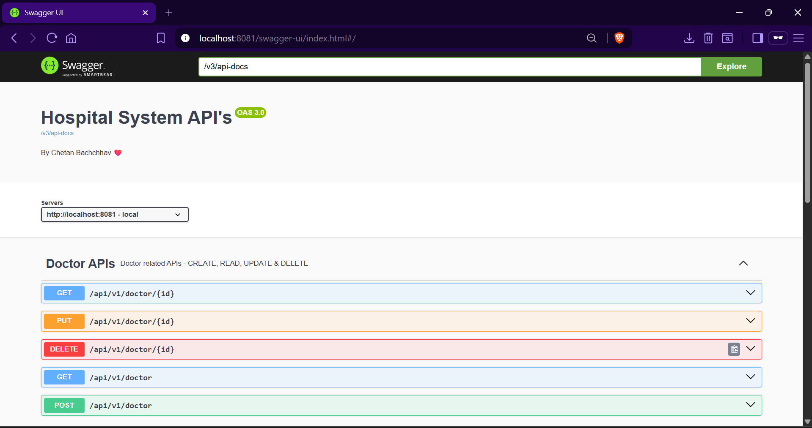

# Swagger API -

- Swagger API is api documentation tool which is used in spring boot.
- It uses `Springdoc OpenAPI` it is designed to generate API documentation from spring boot application.
- `springdoc-openapi-ui` starter to use Swagger UI.
- Swagger uses `/v3/api-docs` endpoint, That provides the **JSON** representation of API documentation.
- default path - `localhost:8080/swagger-ui/index.html`, we can change it application.properties file.

**Springdoc OpenAPI Dependency**
```xml
<depedency>
    <groupId>org.springdoc</groupId>
    <artifactId>springdoc-openapi-ui</artifactId>
    <version>1.7.0</version>
</depedency>
```

**To change Default Path of Swagger UI**
```commandline
springdoc.swagger-ui.path=/doc
```

****
**Swagger UI**
